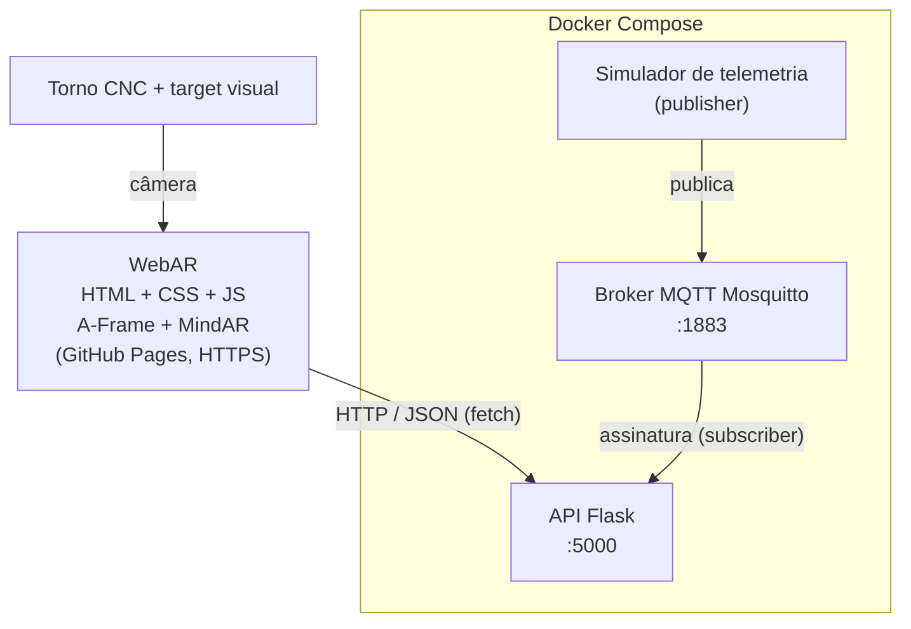

# Sistema de Apoio à Manutenção Industrial com Realidade Aumentada e Serviços em Nuvem

Protótipo didático (ADS — Realidade Aumentada + Computação em Nuvem).
**Ativo:** Torno CNC (`CNC-01`, setor Usinagem).

> **Aviso:** temperatura, vibração, status e demais dados de monitoramento são **simulados e didáticos**.
> Não representam limites reais de segurança ou de manutenção de nenhuma máquina.

- **URL da aplicação WebAR:** `https://SEU-USUARIO.github.io/industria-ra-cloud/`
- **Equipe:** _nomes dos integrantes_

## 1. Arquitetura



| Componente | Responsabilidade |
|---|---|
| WebAR (frontend) | Reconhecer o target, mostrar hotspots, exibir conteúdo estático e consultar a API |
| API Flask | Servir identificação e telemetria em JSON; assinar MQTT e guardar o último valor (em memória) |
| Broker MQTT | Intermediar as mensagens de telemetria (publish/subscribe) |
| Simulador | Publicar dados fictícios periodicamente |
| Docker/Compose | Padronizar e orquestrar a execução dos serviços |

O navegador **não** fala MQTT: ele consulta a API por HTTP/JSON.

## 2. Estrutura do repositório

```
industria-ra-cloud/
├── README.md
├── compose.yaml
├── .github/workflows/pages.yml     # deploy do frontend no GitHub Pages
├── frontend/                       # WebAR (index.html, css, js, assets)
├── backend/                        # API Flask (app.py, requirements.txt, Dockerfile)
├── mqtt/mosquitto.conf             # configuração do broker
├── simulator/                      # publisher MQTT (simulator.py, requirements.txt, Dockerfile)
└── docs/                           # arquitetura, testes e análises
```

## 3. Executar os serviços (Docker Compose)

Pré-requisito: Docker Desktop (ou Docker Engine + Compose v2).

```bash
docker compose up --build
```

| Serviço | Porta no host | Depende de |
|---|---|---|
| `mqtt` | 1883 | — |
| `api` | 5000 | `mqtt` |
| `simulator` | — | `mqtt` |

Verificação:

```bash
curl http://localhost:5000/api/health
curl http://localhost:5000/api/equipamentos/CNC-01
curl http://localhost:5000/api/equipamentos/CNC-01/telemetria
```

(No PowerShell, use `curl.exe` em vez de `curl`.)

Parar tudo: `docker compose down`.

### Endpoints

| Método | Rota | Descrição |
|---|---|---|
| GET | `/api/equipamentos/<id>` | Identificação do ativo |
| GET | `/api/equipamentos/<id>/telemetria` | Último valor de temperatura, vibração, status e horário |
| GET | `/api/health` | Estado da API e da conexão com o broker |

### Tópicos MQTT

```
industria/CNC-01/temperatura     (ex.: 47.2)
industria/CNC-01/vibracao        (ex.: 2.3)
industria/CNC-01/status          (ex.: operando)
```

O simulador publica com `retain=true`, então a API recebe o último valor assim que reconecta.

### Publicar um valor manualmente (teste T06)

```bash
# 1. pare o simulador para ele não sobrescrever o valor
docker compose stop simulator

# 2. publique um valor de teste
docker compose exec mqtt mosquitto_pub -t industria/CNC-01/temperatura -m 99.9 -r

# 3. confira
curl http://localhost:5000/api/equipamentos/CNC-01/telemetria

# 4. volte o simulador
docker compose start simulator
```

## 4. Executar o frontend

### 4.1 No PC (teste rápido)

```bash
cd frontend
python -m http.server 8000
```

Abra `http://localhost:8000`. Em `frontend/js/config.js`, `API_BASE_URL` deve ser `http://localhost:5000`.

### 4.2 No celular (HTTPS obrigatório para a câmera)

O celular não acessa o `localhost` do PC e a página em HTTPS não pode chamar uma API HTTP (bloqueio de *mixed content*).
Solução: expor a API por um túnel HTTPS.

```bash
# com Docker Compose rodando:
cloudflared tunnel --url http://localhost:5000
```

O comando imprime uma URL `https://algo.trycloudflare.com`. Abra no celular:

```
https://SEU-USUARIO.github.io/industria-ra-cloud/?api=https://algo.trycloudflare.com
```

O parâmetro `?api=` sobrescreve o `API_BASE_URL` sem precisar editar e publicar de novo.
(Alternativa: `ngrok http 5000`.) A URL do túnel muda a cada execução.

### 4.3 Publicação (GitHub Pages)

1. Suba o repositório para o GitHub.
2. **Settings → Pages → Source: GitHub Actions**.
3. A cada `push` em `frontend/`, o workflow publica a pasta `frontend`.

## 5. Calibração dos hotspots

`data-x`, `data-y`, `data-z` em `frontend/index.html` são relativos ao target (largura = 1).
X: esquerda (−) / direita (+). Y: baixo (−) / cima (+). Ajuste em passos de 0.02–0.05 e teste no celular.

## 6. Documentação

- `docs/arquitetura.md` — diagrama (exportar para `arquitetura.png`)
- `docs/testes.md` — matriz de testes T01–T09
- `docs/analises.md` — decisões de dados, containers e IaaS/PaaS/SaaS

## 7. Limitações conhecidas

- Dados em memória (sem banco): reiniciar a API perde o histórico (o valor retido no broker restaura o último).
- Broker sem autenticação e sem TLS (didático).
- CORS liberado para qualquer origem (`*`) — restringir em produção.
- URL do túnel gratuito é temporária.
