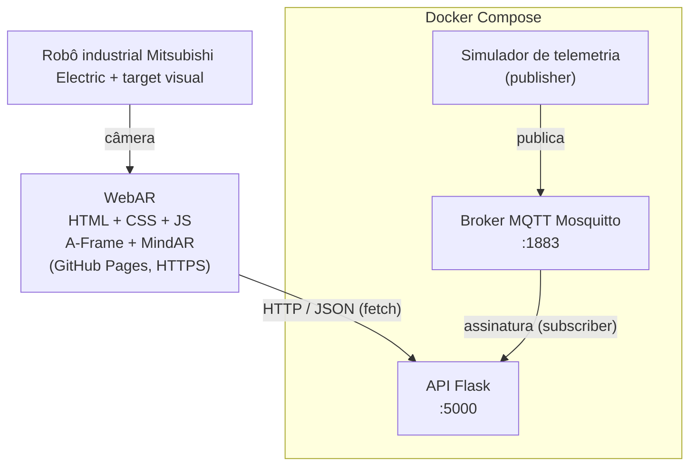

# Sistema de Apoio à Manutenção Industrial com Realidade Aumentada e Serviços em Nuvem

Protótipo didático (ADS — Realidade Aumentada + Computação em Nuvem).
**Ativo:** robô industrial Mitsubishi Electric (`ROBO-01`, setor Manufatura).

> **Aviso:** temperatura, vibração, status e demais dados de monitoramento são **simulados e didáticos**.
> Não representam limites reais de segurança ou de manutenção de nenhuma máquina.

- **URL da aplicação WebAR:** https://lucaspatracao.github.io/industria-ra-cloud/frontend/
- **Repositório:** https://github.com/lucaspatracao/industria-ra-cloud
- **Equipe:** _nomes dos integrantes_

## Ativo: robô industrial Mitsubishi Electric

- Série MELFA FR, exemplo RV-2FR, MODELO A CONFIRMAR NA ETIQUETA do robô.
- Braço articulado vertical de 6 eixos, carga máxima de 2 kg, alcance de 504 mm, IP40.
- Curso das juntas: J1 ±240°, J2 ±120°, J3 0° a +161°, J4 ±200°, J5 ±120°, J6 0° a ±360°.
- Controlador CR800-D (autônomo); versões R e Q integram-se a CLPs MELSEC.
- A carga máxima vale com a interface mecânica voltada para baixo (±10° da vertical).
- Fonte: ficha técnica oficial da Mitsubishi Electric F.A. (MELFA). Estes valores são de catálogo, não parâmetros de segurança, e podem variar conforme o modelo.

> O ponto 5 de monitoramento contém o botão de emergência e serve de gancho para a discussão de segurança; não invente procedimentos oficiais.

## 1. Arquitetura



| Componente | Responsabilidade |
|---|---|
| WebAR (frontend) | Reconhecer o target, mostrar hotspots, exibir conteúdo estático e consultar a API |
| API Flask | Servir identificação e telemetria em JSON; assinar MQTT e guardar o último valor (em memória) |
| Broker MQTT | Intermediar as mensagens de telemetria (publish/subscribe) |
| Simulador | Publicar dados fictícios periodicamente |
| Docker/Compose | Padronizar e orquestrar a execução dos serviços |

O navegador **não** fala MQTT: ele consulta a API por HTTP/JSON.

## 2. Estrutura do repositório

```
industria-ra-cloud/
├── README.md
├── compose.yaml
├── frontend/                       # WebAR (index.html, css, js, assets)
├── backend/                        # API Flask (app.py, requirements.txt, Dockerfile)
├── mqtt/mosquitto.conf             # configuração do broker
├── simulator/                      # publisher MQTT (simulator.py, requirements.txt, Dockerfile)
└── docs/                           # arquitetura, testes e análises
```

## 3. Executar os serviços (Docker Compose)

Pré-requisito: Docker Desktop (ou Docker Engine + Compose v2).

```bash
docker compose up --build
```

| Serviço | Porta no host | Depende de |
|---|---|---|
| `mqtt` | 1883 | — |
| `api` | 5000 | `mqtt` |
| `simulator` | — | `mqtt` |

Verificação:

```bash
curl http://localhost:5000/api/health
curl http://localhost:5000/api/equipamentos/ROBO-01
curl http://localhost:5000/api/equipamentos/ROBO-01/telemetria
```

(No PowerShell, use `curl.exe` em vez de `curl`.)

Parar tudo: `docker compose down`.

### Endpoints

| Método | Rota | Descrição |
|---|---|---|
| GET | `/api/equipamentos/<id>` | Identificação do ativo |
| GET | `/api/equipamentos/<id>/telemetria` | Último valor de temperatura, vibração, status e horário |
| GET | `/api/health` | Estado da API e da conexão com o broker |

### Tópicos MQTT

```
industria/ROBO-01/temperatura     (ex.: 47.2)
industria/ROBO-01/vibracao        (ex.: 2.3)
industria/ROBO-01/status          (ex.: operando)
```

O simulador publica com `retain=true`, então a API recebe o último valor assim que reconecta.

### Publicar um valor manualmente (teste T06)

```bash
# 1. pare o simulador para ele não sobrescrever o valor
docker compose stop simulator

# 2. publique um valor de teste
docker compose exec mqtt mosquitto_pub -t industria/ROBO-01/temperatura -m 99.9 -r

# 3. confira
curl http://localhost:5000/api/equipamentos/ROBO-01/telemetria

# 4. volte o simulador
docker compose start simulator
```

## 4. Executar o frontend

### 4.1 No PC (teste rápido)

```bash
cd frontend
python -m http.server 8000
```

Abra `http://localhost:8000`. Em `frontend/js/config.js`, `API_BASE_URL` deve ser `http://localhost:5000`.

### 4.2 No celular (HTTPS obrigatório para a câmera)

O celular não acessa o `localhost` do PC e a página em HTTPS não pode chamar uma API HTTP (bloqueio de *mixed content*).
Solução: expor a API por um túnel HTTPS.

```bash
# com Docker Compose rodando:
cloudflared tunnel --url http://localhost:5000
```

O comando imprime uma URL `https://algo.trycloudflare.com`. Abra no celular:

```
https://lucaspatracao.github.io/industria-ra-cloud/frontend/?api=https://algo.trycloudflare.com
```

Antes de abrir a WebAR, teste o túnel no celular: `https://algo.trycloudflare.com/api/health` deve mostrar um JSON.

**Por que é necessário?** Na página publicada, `API_BASE_URL` padrão (`http://localhost:5000`) não funciona:
no celular, `localhost` é o próprio celular; e uma página HTTPS pública não deve (e o navegador pode bloquear) acessar um serviço HTTP local.
Quando isso acontece, o painel do ponto 5 mostra a mensagem de indisponibilidade e uma linha com a causa provável.

O parâmetro `?api=` sobrescreve o `API_BASE_URL` sem precisar editar e publicar de novo.
(Alternativa: `ngrok http 5000`.) A URL do túnel muda a cada execução.

### 4.3 Publicação (GitHub Pages)

1. Suba o repositório para o GitHub (branch `main`).
2. **Settings → Pages → Build and deployment → Source: Deploy from a branch → `main` / `(root)`**.
3. O site fica em `https://lucaspatracao.github.io/industria-ra-cloud/frontend/` (a pasta `frontend` faz parte do endereço).
4. Cada `push` republica automaticamente em ~1 a 2 minutos.

## 5. Calibração dos hotspots

`data-x`, `data-y`, `data-z` em `frontend/index.html` são relativos ao target.
A imagem-alvo tem 1086×1448 px (retrato). Largura = 1 unidade, Y vai de −0.667 a +0.667.
Fórmulas: `x = px/1086 − 0.5` e `y = (724 − py)/1086`.

| Ponto | Região | Pixel aprox. | data-x | data-y | data-z |
|---|---|---|---|---|---|
| 1 | Base | (−) | −0.10 | −0.11 | 0.03 |
| 2 | Braço | (−) | −0.09 | 0.30 | 0.03 |
| 3 | Punho | (−) | 0.26 | 0.42 | 0.03 |
| 4 | Garra (ventosa) | (−) | 0.26 | 0.30 | 0.03 |
| 5 | Monitoramento (pendente de ensino) | (−) | 0.13 | −0.04 | 0.03 |

Ajuste em passos de 0.02–0.05 depois de testar no celular.

## 6. Documentação

- `docs/arquitetura.md` — diagrama (exportar para `arquitetura.png`)
- `docs/testes.md` — matriz de testes T01–T09
- `docs/analises.md` — decisões de dados, containers e IaaS/PaaS/SaaS

## 7. Limitações conhecidas

- Dados em memória (sem banco): reiniciar a API perde o histórico (o valor retido no broker restaura o último).
- Broker sem autenticação e sem TLS (didático).
- CORS liberado para qualquer origem (`*`) — restringir em produção.
- URL do túnel gratuito é temporária.