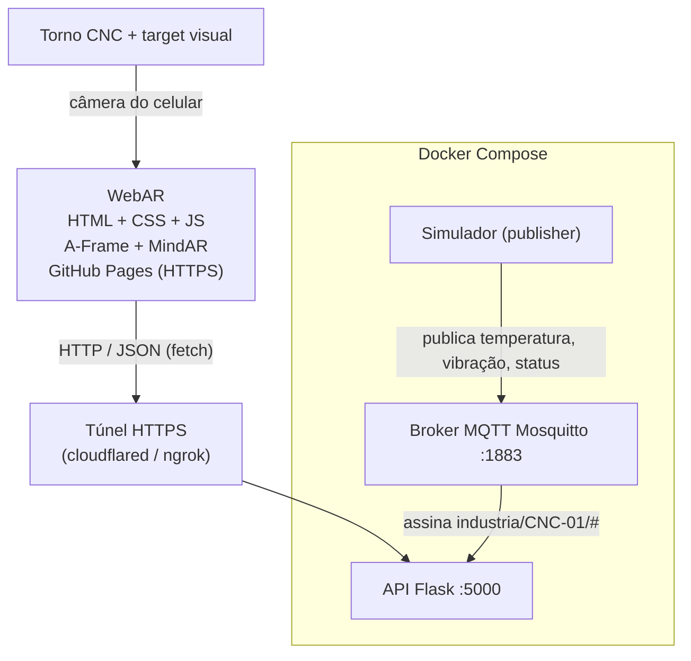

# Arquitetura

Para gerar `arquitetura.png`: cole o bloco abaixo em https://mermaid.live e exporte como PNG.

## Fluxo de dados

1. O simulador publica em `industria/CNC-01/temperatura|vibracao|status` (com `retain`).
2. O broker entrega as mensagens à API (subscriber).
3. A API guarda o último valor em memória.
4. O usuário toca no hotspot 5; o frontend faz `GET /api/equipamentos/CNC-01` e `.../telemetria`.
5. O painel exibe os dados ou a mensagem de indisponibilidade.
